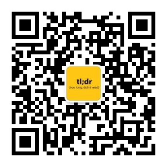
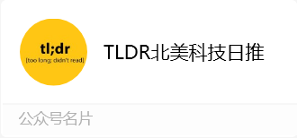
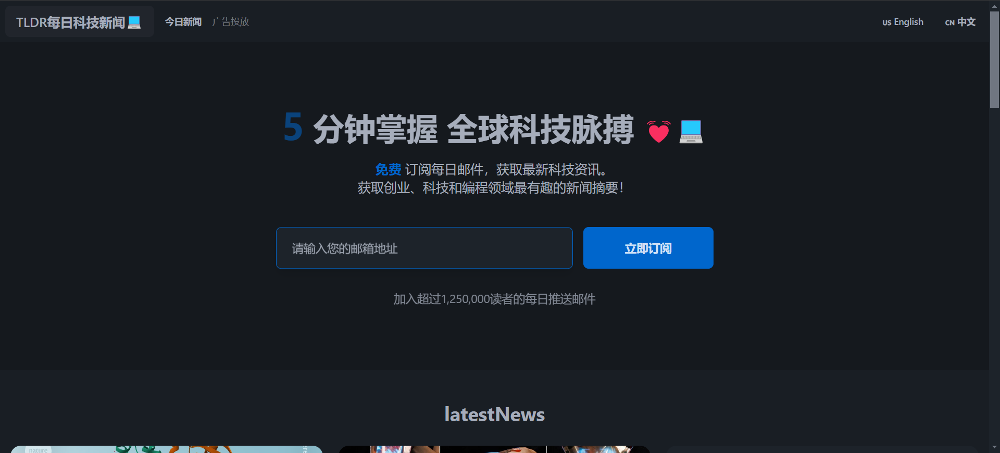
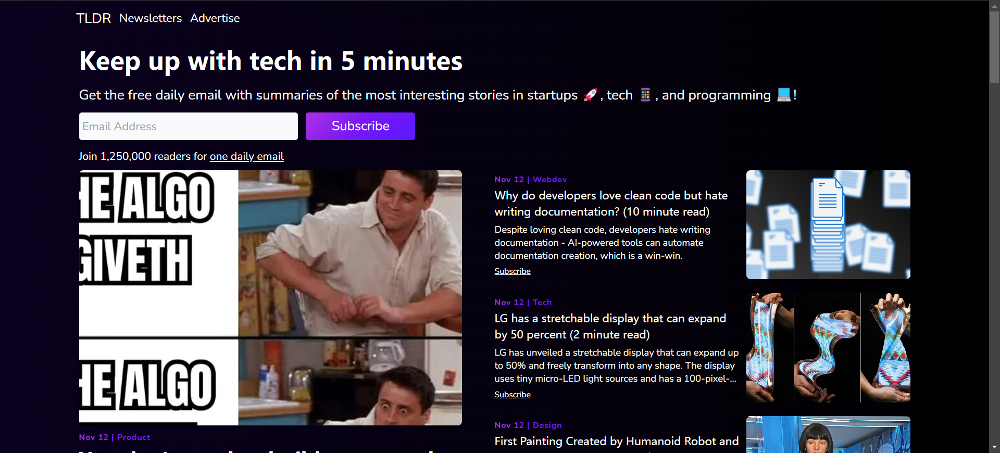
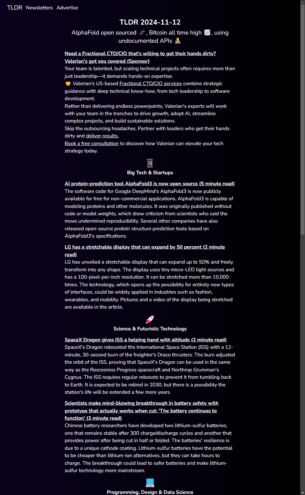
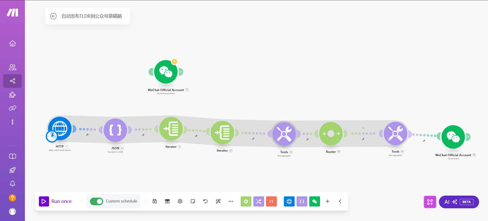

# TLDR Tech Newsletter (Chinese) TLDR科技新闻（中文版）

## 🌈 在线体验 Live Demo

- 📱 Web网页版 Website：https://www.tldrnewsletter.cn
- 📱 微信公众号 WeChat Public Account：[TLDR北美科技日推](https://mp.weixin.qq.com/s/8k55rjuc4GCsYlrD_i5n3A)

  
  

## 💡 项目介绍 Project Introduction

🌏 将TLDR Tech Newsletter的每日科技新闻翻译成中文,让中文读者快速了解全球科技动态。

A Chinese translation of TLDR Tech daily newsletter, helping Chinese readers stay updated with global tech news.

  <table>
    <tr>
      <td align="center">
        
        
<em>TLDR Chinese Newsletter</em>

      </td>
      <td align="center">
        
        
<em>TLDR Tech News (Original Source)</em>

      </td>
    </tr>
  </table>

Source: [TLDR.tech](https://tldr.tech)

Translation powered by [DeepL API](https://www.deepl.com/)

  <table>
    <tr>
      <td align="center">
        
        
<em>Daily Newsletter example</em>

      </td>
      <td align="center">
        
        
<em>Daily Newsletter example (Original Source)</em>

      </td>
    </tr>
  </table>

## ✨ 特色功能 Features

- 📰 每日自动生成微信公众号文章并定时发布 / Automatically generate and publish WeChat articles daily
  

    

  _Automated Workflow to publish WeChat articles using [Make](https://www.make.com/)_
  

- 🤖 自动翻译英文科技新闻 / Auto-translate English tech news
- 🌐 双语对照阅读 / Bilingual reading
- 📱 移动端适配 / Mobile responsive
- 🖼️ 智能提取文章配图 / Smart article image extraction
- 🔍 按日期浏览历史新闻 / Browse historical news by date

## 🎯 目标用户群 Target Audience

- 关注全球科技动态的中文读者 / Chinese readers interested in global tech news
- 想提升英文阅读能力的科技爱好者 / Tech enthusiasts who want to improve English reading
- 需要快速了解行业动态的IT从业者 / IT professionals who need quick industry updates
- 对科技创新感兴趣的学生 / Students interested in tech innovation

## 🎯 项目趣事 Project Fun Facts

- 🚀 本项目由 Cursor AI 辅助，在24小时内完成主要开发 / Main development completed within 24 hours with Cursor AI assistance
- 📹 开发日志视频 Development Vlog：[24小时挑战：用AI助手开发一个翻译机器人 / 24h Challenge: Building a Translation Bot with AI Assistant](https://www.bilibili.com/video/BV1QQDcY9EnS/)

## 🛠️ 技术栈 Tech Stack

### 前端 Frontend

- DaisyUI 组件库 / DaisyUI Component Library

### 后端 Backend

- DeepL API 翻译服务 / Translation Service
- BeautifulSoup4 网页解析 / Web Scraping

## 📝 开源协议 License

MIT License © 2024 TLDR Chinese Newsletter

## 🤝 贡献指南 Contributing

欢迎提交 Issue 和 Pull Request! / Welcome to contribute!
