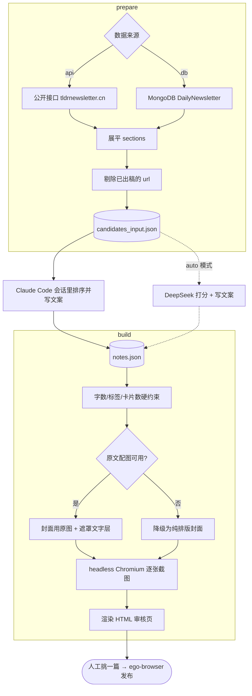

# feat: 小红书每日选题 / 出图 / 半自动发布流水线

## Summary

在现有新闻流水线之外新增一条本地流水线：取当天新闻，选出 3 条最有传播潜力的，为每条独立生成一篇小红书笔记（3-4 张 1080×1440 卡片 + 标题 + 正文 + 标签），产出一个 HTML 审核页；运营者挑一篇，由 ego-browser 在会话中执行发布。

选题和写文案这一层有两种跑法，共用同一套渲染和审核页：**会话接管**（默认，`prepare` → Claude Code 会话里排序写文案 → `build`，不需要任何 API key）和**全自动**（`auto`，用 DeepSeek，需要 key 和数据库凭据）。

---

## Problem Frame

TLDRChinese 的四条分发渠道里，小红书是唯一没打通、也是唯一自带自然流量分发的一条。没打通的原因是单篇手工成本 20-30 分钟（选题判断 + 排版出图 + 写小红书语感的文案），坚持不下来。

这条链的上游资产其实都在：新闻已翻译并存进 MongoDB，`api/services/newsletter.py:164` 在抓取阶段就调用 `extract_article_image` 把每篇文章的 `image_url` 写进了文档，`api/services/title_generator.py` 已经是"OpenAI SDK 指向 DeepSeek + 中文 prompt + 降级兜底"的成熟模式，`scripts/update_articles.py` 给出了本地脚本连接同一个 MongoDB 的现成写法。

缺的只有三段：把新闻按传播潜力排序的判断层、把文字变成卡片图的渲染层、以及一个让人在一分钟内决定发哪篇的审核入口。

---

## High-Level Technical Design

流水线在「排序 + 写文案」这一层分岔，两条路汇回同一套渲染和审核页。分支门有三处：当天无刊直接产出说明页、配图不可用时降级而非跳过、单条候选失败不影响其余。



两条路能共用同一套下游，是因为 `run_pipeline` 把打分器和文案器作为参数注入。会话模式下传入的 `PreparedScorer` / `PreparedCopywriter` 只是把 `notes.json` 里已经写好的内容原样回放，不做任何判断。

选题、文案两个 DeepSeek 服务放在 `api/services/` 与 `title_generator.py` 并列，留下将来挂成 Vercel cron 路由的口子。渲染、编排、发布三层是本地专属，放在 `scripts/xhs/`，依赖单独声明在 `scripts/xhs/requirements-local.txt`。`.vercelignore` 本来就排除了 `scripts/` 和 `tests/`，所以部署包不受影响。

---

## Requirements

R-ID 与 origin 文档一一对应，便于回溯。

**选题**

- R1. 每天从当天 `DailyNewsletter` 中选出至多 3 条候选，每条独立成篇。
- R2. 打分维度显式定义且可调，至少覆盖：中文读者对该主体的认知度、是否有冲突或反差、是否有数字冲击力、与普通人生活的相关度。
- R3. 已经出过稿的新闻不重复进入候选。

**出图**

- R4. 每篇笔记产出 3-4 张图，尺寸 1080×1440。
- R5. 首图是钩子封面，承载标题的核心冲突点，不是新闻标题的直译。
- R6. 优先复用文章的 `image_url`；缺失或加载失败时降级到纯排版模板，不中断出稿。
- R7. 图中所有文字由 HTML 渲染，不经过图像生成模型。

**文案**

- R8. 标题 ≤20 字符，实际控制在 18 以内。
- R9. 正文 ≤1000 字符，实际控制在 950 以内。
- R10. 正文自身信息完整，读者不点原文也能获得完整判断。
- R11. 每篇配 3-6 个标签。

**审核与发布**

- R12. 流水线每次跑完产出一个 HTML 审核页，候选一屏可比。
- R13. 审核页直接展示成图，文案可一键复制。
- R14. 选定后由 ego-browser 完成上传图片、填标题正文标签、发布。
- R15. 登录态失效时交还浏览器控制权并明确提示扫码，不静默失败也不自动重试。

---

## Key Technical Decisions

**选题和文案默认由 Claude Code 会话承担，DeepSeek 降为备用路径。** 这一层唯一的产物是一个 `notes.json`，谁写的不影响下游。会话来写省掉了 API key、省掉了调 prompt 的迭代成本，中文文案质量也更好；代价是这条链永远不可能无人值守。因为流程本来就要求人在场审核，这个代价当前接近于零——真正被关掉的门只有「早上起来审核页已经在那儿了」。DeepSeek 那两个服务保留为 `auto` 子命令，将来想挂无人值守不用重写。

**`prepare` 默认走公开接口而不是 MongoDB。** `https://www.tldrnewsletter.cn/api/newsletter/<date>` 返回的字段形状与 `DailyNewsletter.sections` 完全一致，且不需要数据库凭据。副作用是这条路没有 `XhsPost` 可查，去重改为扫历史产物目录里的 `note.json`——够用，且天然跟着产物走。`--source db` 保留完整的数据库路径。

**整条流水线跑在本地单进程，不新增 Vercel cron 路由。** 渲染依赖 Chromium、发布依赖真实登录态，两者都无法搬到 serverless；把打分单独放云端只会多出一个跨环境接缝和一次额外的 Mongo 往返，换不来任何东西。入口沿用 `scripts/update_articles.py` 的写法：`sys.path` 加根目录 → `create_app()` → `with app.app_context()`。

**判断层放 `api/services/`，执行层放 `scripts/xhs/`。** 打分和文案是纯 API 调用、无本地依赖，放进服务层与 `title_generator.py` 并列，将来想挂 cron 路由不用搬家。渲染、编排、发布有本地依赖，留在 `scripts/xhs/`。

**Playwright 驱动 Chromium 截图，依赖单独声明。** 相比直接调用系统 Chrome 的 `--headless --screenshot`，Playwright 能精确控制 viewport、`device_scale_factor` 和"等图片与字体加载完成"的时机——这正是选择 HTML 模板而非 AI 生图的全部理由所在。依赖写进 `scripts/xhs/requirements-local.txt`，不进 `requirements.txt`，避免 Vercel 部署包体积膨胀。

**出稿记录用 MongoDB 新集合，不用本地 JSON。** mongoengine 已在依赖里，新增一个 Document 的成本接近零；记录跟着数据库走，重装 Mac 不丢，也为后续"用发布后数据反过来校准打分"留了落点。

**打分和文案分两次 DeepSeek 调用，不合并成一次。** 打分要处理当天全部条目（十几到几十条），文案只处理选中的 3 条。合并会让 prompt 又长又杂，且任何一条文案写崩就要整批重来。分开后单次失败只影响一条候选。

**打分返回结构化 JSON 并做防御性解析。** `title_generator.py` 只需要一行纯文本，容错要求低；打分需要 `[{url, score, reason}]` 这种结构。DeepSeek 偶尔会在 JSON 外包一层 markdown 代码块，解析必须剥壳并在失败时降级——降级策略是回退到"按 section 顺序取前 3 条"，保证流水线永远有输出。

**引入 pytest，只覆盖纯逻辑层。** 仓库目前没有测试框架（`scripts/test_*.py` 是手动冒烟脚本，不是 pytest 用例）。打分解析、字数裁剪、去重、配图降级这四处是会静默出错且不需要网络的逻辑，值得真实用例覆盖。浏览器发布依赖真实登录态，不写自动化测试，改为人工跑通一次并固化成操作规程（U6）。

**审核页是静态 HTML，发布由会话触发。** 不做本地服务接按钮。审核页只负责"看清楚、能复制"，运营者在 Claude Code 会话里说"发第 N 篇"，由 ego-browser 读取该篇的产物目录执行发布。少一个常驻进程，MVP 阶段的收益远大于点按钮的便利。

---

## Implementation Units

### U1. 选题打分服务

- **Goal:** 输入当天展平后的文章列表，输出按传播潜力排序的候选。
- **Requirements:** R1, R2
- **Dependencies:** 无
- **Files:**
  - `api/services/xhs_scorer.py`（新建）
  - `tests/test_xhs_scorer.py`（新建）
- **Approach:** 类结构镜像 `api/services/title_generator.py`——构造函数接收 api_key，内部持有指向 `https://api.deepseek.com` 的 OpenAI client。对外暴露 `score_articles(articles) -> list[dict]`，返回按 score 降序的 `{url, score, reason}`。四个打分维度写进 prompt 并各自给出 0-10 的分档说明，总分为加权和，权重作为模块级常量便于调整。要求模型只返回 JSON 数组。解析时先剥 markdown 代码块围栏再 `json.loads`；解析失败或返回条数为零时记录 error 并返回原始顺序的前 3 条，保证调用方永远拿得到结果。
- **Patterns to follow:** `api/services/title_generator.py` 的 client 初始化、中文 prompt 组织方式、`try/except` 包住整个方法并返回兜底值。
- **Test scenarios:**
  - 正常 JSON 数组输入 → 按 score 降序返回，条数与输入一致
  - 返回值被 ```json 代码块包裹 → 正确剥壳解析
  - 返回值为非法 JSON → 返回输入列表的前 3 条，不抛异常
  - 返回的 url 有一个不在输入列表里 → 该条被丢弃，其余正常
  - 输入列表为空 → 返回空列表，不调用 API
  - 权重常量调整后，同一组模型输出产生不同排序 → 验证加权逻辑真的生效而非直接取模型的总分
- **Verification:** 用一份真实的 `DailyNewsletter.sections` 跑一次，人工检查选出的 3 条是否合理；所有解析分支的用例通过。

### U2. 出稿记录模型与去重

- **Goal:** 持久化"哪条新闻已经出过稿、发布状态如何"，支撑去重与后续数据回流。
- **Requirements:** R3
- **Dependencies:** 无
- **Files:**
  - `api/models/xhs_post.py`（新建）
  - `tests/test_xhs_dedup.py`（新建）
- **Approach:** 新增 `XhsPost` Document，集合名 `xhs_posts`。字段涵盖：来源文章 url（唯一索引）、来源日期、生成的标题/正文/标签、产物目录路径、状态（`drafted` / `published` / `discarded`）、生成时间、发布时间。去重函数 `filter_unpublished(articles)` 按 url 集合做差集。状态设计上 `drafted` 也算已出稿——同一条新闻生成过就不再重复生成，避免审核页每天出现昨天已经看过又没选的内容。
- **Patterns to follow:** `api/models/article.py` 的 `db.Document` 定义方式、`meta` 中的 `collection` 与 `indexes` 声明。
- **Test scenarios:**
  - 输入 10 篇、其中 3 篇 url 已存在于 `xhs_posts` → 返回 7 篇
  - 已存在记录状态为 `discarded` → 仍然被过滤掉，不重复生成
  - `xhs_posts` 为空 → 原样返回全部输入
  - 输入中有两篇 url 相同 → 结果中该 url 只出现一次
  - 同一 url 重复写入 → 唯一索引拒绝，调用方拿到明确异常而非静默覆盖
- **Verification:** 连续跑两天流水线，第二天的候选中不出现第一天已生成的条目。

### U3. 文案生成服务

- **Goal:** 为单条新闻生成符合小红书语感且硬性满足字数限制的标题、正文、标签。
- **Requirements:** R5, R8, R9, R10, R11
- **Dependencies:** 无
- **Files:**
  - `api/services/xhs_copywriter.py`（新建）
  - `tests/test_xhs_copywriter.py`（新建）
- **Approach:** 暴露 `generate_note(article) -> dict`，返回 `{title, body, tags, cover_hook, cards}`。`cards` 是正文拆成的 2-3 段卡片文字，供渲染层直接用，避免渲染层再做一次切分判断。prompt 明确三件事：正文必须自身完整（读者不点原文也能拿到判断）、不出现引导点击外链的表述、封面钩子写冲突点而非标题直译。字数控制不信任模型自觉——生成后由 `_enforce_limits` 做确定性检查，标题超 18 或正文超 950 时带着"当前 N 字符，需压到 M 以内"重新请求一次，第二次仍超限则做硬截断并记录 warning。
- **Patterns to follow:** `api/services/title_generator.py` 的 prompt 组织与兜底返回。
- **Test scenarios:**
  - 模型返回标题 25 字符 → 触发重写请求；重写后合规则采用
  - 重写后仍超限 → 硬截断到 18 字符并记录 warning，不抛异常
  - 正文 990 字符 → 触发重写（阈值是 950 而非 1000，留标签余量）
  - 返回标签 8 个 → 截到 6 个
  - 返回标签 1 个 → 记录 warning 但不阻断出稿
  - 中英混排与 emoji 场景下的字符计数 → 按字符而非字节计，一个中文和一个英文字母各计 1
  - API 调用抛异常 → 返回 None，调用方跳过这条候选而非整批失败
- **Verification:** 对 5 篇真实新闻各跑一次，全部输出满足字数硬限制，人工判断正文是否"不看原文也能读懂"。

### U4. 卡片模板与截图渲染

- **Goal:** 把一篇笔记的文案渲染成 3-4 张 1080×1440 PNG。
- **Requirements:** R4, R6, R7
- **Dependencies:** 无
- **Files:**
  - `scripts/xhs/render.py`（新建）
  - `scripts/xhs/templates/card.html`（新建）
  - `scripts/xhs/requirements-local.txt`（新建）
  - `tests/test_xhs_render.py`（新建）
- **Approach:** 单个 `card.html` 承载两种版式，通过注入的 `variant` 字段切换：`cover`（钩子大字，有配图时作背景并压半透明遮罩保证文字对比度）与 `body`（分段正文）。模板用字符串占位替换填充，不引入模板引擎——依赖已经够多了。`render.py` 暴露 `render_note(note, out_dir) -> list[Path]`，用 Playwright 同步 API 开一个 `viewport={'width':1080,'height':1440}`、`device_scale_factor=2` 的页面，逐张 `set_content` 后 `page.screenshot()`。配图处理是关键分支：先对 `image_url` 发 HEAD 请求确认可达且 content-type 是图片，可用则走 `cover` 带图版式，不可用（缺失、超时、404、非图片）则走纯排版版式，两条路都必须产出文件。截图前显式等待 `networkidle` 与 `document.fonts.ready`，否则会截到字体回退或图片空白。
- **Patterns to follow:** `api/services/image_extractor.py` 的 requests 用法（自定义 User-Agent、显式 timeout、异常吞掉返回 None）。
- **Test scenarios:**
  - 一篇含封面 + 3 段正文的笔记 → 产出 4 个文件，每个尺寸恰好 2160×2880（scale factor 2）
  - `image_url` 为 None → 走纯排版版式，仍产出完整张数
  - `image_url` 指向 404 → 同上降级，且不抛异常
  - `image_url` 指向一个 HTML 页面而非图片 → content-type 检查拦下，走降级
  - 配图请求超时 → 在设定的 timeout 内返回并降级，不无限等待
  - 封面文字为 18 个中文字符（标题上限） → 不溢出卡片边界
  - 输出目录已存在同名文件 → 覆盖而非报错，支持重跑
- **Verification:** 肉眼检查 4 张成图在手机尺寸下文字清晰、无截断、配图无变形；带图与降级两条路径各跑通一次。

### U5. 流水线编排与审核页

- **Goal:** 把 U1-U4 串起来，产出当天的全部候选与审核页。三个子命令：`prepare` 取新闻落盘待选清单，`build` 读排好的文案出图并渲染审核页，`auto` 用 DeepSeek 一段跑完。
- **Requirements:** R1, R12, R13
- **Dependencies:** U1, U2, U3, U4
- **Files:**
  - `scripts/xhs/run_daily.py`（新建）
  - `scripts/xhs/templates/review.html`（新建）
  - `.gitignore`（修改，忽略产物目录）
  - `tests/test_xhs_pipeline.py`（新建）
- **Approach:** 入口沿用 `scripts/update_articles.py` 的骨架。顺序为：按美东日期取 `DailyNewsletter`（复用 `api/routes.py` 中 `pytz.timezone('US/Eastern')` 的口径，与现有 cron 保持同一天的概念）→ 展平 `sections` 为文章列表 → U2 去重 → U1 打分 → 取前 3 → 逐条 U3 出文案、U4 出图 → 写 `XhsPost` 记录（状态 `drafted`）→ 渲染审核页。产物落在 `scripts/xhs/output/YYYY-MM-DD/<序号>/`，图片与 `note.json` 同目录。审核页是自包含单文件，图片用相对路径引用同目录产物，每篇一个区块展示成图、标题、正文、标签，各带一个复制按钮，并显式标出序号供运营者在会话中指名。当天无刊、去重后为空、可用条目不足 3 条这三种情况都要产出审核页并在页面上写明原因，不能静默退出——静默退出会让人误以为脚本挂了。单条候选生成失败时跳过该条、继续其余，最后在审核页标注失败条目。
- **Execution note:** 先写一个用假数据跑通全流程的集成测试，再接真实 DeepSeek 调用——这条链上有四个外部依赖，端到端手动调试的成本远高于先把编排逻辑锁死。
- **Patterns to follow:** `scripts/update_articles.py` 的 app context 初始化与 `logging` 用法；`api/routes.py:605` 附近的美东日期口径。
- **Test scenarios:**
  - Covers AE5. 当天可用条目只有 2 条 → 产出 2 篇候选，审核页写明实际数量
  - 当天无 `DailyNewsletter` → 产出说明性审核页，退出码为 0（周末无刊是正常状态，不是错误）
  - 去重后可用条目为 0 → 同上
  - 3 条候选中第 2 条文案生成返回 None → 第 1、3 条正常产出，审核页标注第 2 条失败
  - 同一天重复执行 → 覆盖当天产物目录，不产生第二份记录
  - 审核页中的图片相对路径 → 用 `file://` 直接打开时能正常显示
  - 展平逻辑遇到 `sections` 中某个 section 没有 `articles` 键 → 跳过该 section，不抛 KeyError
- **Verification:** `python scripts/xhs/run_daily.py` 一条命令跑完，浏览器打开审核页能看到 3 篇完整候选。

### U6. 发布流程固化

- **Goal:** 把"从审核页选中一篇到笔记发布成功"变成一份可重复执行的规程，含登录态失效的处理。
- **Requirements:** R14, R15
- **Dependencies:** U5
- **Files:**
  - `scripts/xhs/PUBLISH.md`（新建）
- **Approach:** 人工用 ego-browser 在 creator.xiaohongshu.com 完整跑通一次发布，把过程固化成规程：task space 命名约定、进入发布页的路径、图片批量上传的调用方式、标题与正文输入框的定位方式、标签录入方式、发布按钮确认、以及发布后回写 `XhsPost` 状态为 `published`。定位优先用可见文本而非 CSS 选择器——小红书前端类名是混淆的，改版后文本比类名稳定。登录态失效的处理必须写死在规程里：检测到未登录立刻 `handOffTaskSpace` 并提示扫码，等运营者确认后 `takeOverTaskSpace` 续跑，绝不自动重试、绝不换账号、绝不把失败当成功回报。规程同时写明失败时的人工兜底路径（直接用产物目录的图和文案在手机上发）。
- **Patterns to follow:** ego-browser skill 的 task space 生命周期约定与控制权交接协议。
- **Test scenarios:** `Test expectation: none -- 这一步产出的是操作规程而非代码；正确性由人工跑通一次真实发布来验证，自动化测试需要真实登录态，成本远高于收益。`
- **Verification:** 用当天的一篇真实候选完整发布成功；主动登出后重跑一次，确认流程停在扫码提示而不是静默失败。

---

## Acceptance Examples

- AE1. **Covers R3.** 某条新闻昨天已被选为候选并出过图，今天新闻列表里仍然存在 → 今天的候选中不出现它。
- AE2. **Covers R6.** 某条新闻的 `image_url` 不可用 → 该篇仍产出完整张数的纯排版卡片，审核页正常展示，不因缺图跳过这条。
- AE3. **Covers R8, R9.** 生成的标题为 23 字符 → 在产出审核页之前压到 18 以内，超限内容不进审核页。
- AE4. **Covers R15.** 发布时登录态已失效 → 流程停在扫码提示上，不重试、不换账号、不把失败当成功回报。
- AE5. **Covers R1.** 当天可用条目少于 3 条 → 产出实际数量的候选并在审核页说明，不用低质条目凑满 3 篇。

---

## Scope Boundaries

### Deferred to Follow-Up Work

- launchd 定时触发。第一版手动执行 `python scripts/xhs/run_daily.py`；跑顺了再挂定时。
- 审核页内嵌发布按钮（需要本地常驻服务）。
- 打分服务挂成 Vercel cron 路由——服务层的位置已经为此留好，但这一版不做。

### Deferred for later

- 未选中的另外两篇候选的复用与排期，MVP 里就是丢弃。
- 多套图片模板、按新闻类型切换版式。
- 用发布后的点赞收藏数据反过来校准打分权重。
- 视频、图文以外的形态。

### Outside this product's identity

- 全自动发布。省的时间不值一个天天可能挂的环节，也拿掉了内容质量的最后一道闸。
- `write-xiaohongshu` skill 那套"先研究同类爆款再动笔"的流程。它整条依赖小红书 MCP，当前环境未安装，不作为本次前提。
- 账号定位、头像、简介的重做。

---

## 实现结果与偏差

计划写完之后，执行过程中有三处偏离了原计划，都是执行时才暴露的信息导致的：

**加了 `prepare` / `build` 两段模式，DeepSeek 从默认降为备用。** 原计划只有 DeepSeek 一条路。执行时发现 `.env` / `.env.local` 里的 `DEEPSEEK_API_KEY` 和 `MONGODB_URI` 都是占位符（`your_deepseek_key`），端到端验证跑不起来；同时既然人本来就要在场审核，让会话直接承担选题和文案反而更省事、中文质量也更好。两段模式让两条路共用下游。

**去重逻辑拆成纯函数加查询两部分。** 原计划把 `filter_unpublished` 放在 `api/models/xhs_post.py` 里。实际拆成 `api/services/xhs_dedup.py`（纯逻辑，无依赖）和模型文件（只有 Document 定义）。原因是 `api/__init__.py` 会拉起整套 flask 依赖，纯逻辑测试不该为此付代价。

**配图探测超时从 8 秒放宽到 15 秒。** 真实跑的时候 `storage.ghost.io` 回 HEAD 用了 9.6 秒，8 秒会把一张能用的封面图误判成不可用。诊断确认那台 CDN 不拒绝 HEAD，只是冷缓存慢。

### 验证状态

`prepare` → 会话排序写文案 → `build` 这条默认路径，用 2026-08-08 的 14 篇真实新闻端到端跑通过：选出 3 篇，产出 12 张图和审核页，零失败，带配图和降级两条渲染路径都实际走到。75 个测试通过。

**未验证：** `auto`（DeepSeek）路径一次都没跑过，只有单元测试覆盖；U6 的发布环节一次都没跑过，`scripts/xhs/PUBLISH.md` 里的选择器全部是推导的，需要一次真人监督的发布来确认。这是 `status` 仍为 `active` 的唯一原因。

---

## Risks & Dependencies

**小红书对浏览器自动化发布的检测强度未知。** 这是整个计划里唯一无法在实现阶段消除的不确定性。缓解措施：发布保持人工触发（不是定时批量）、每天只发一篇、U6 的规程里写明人工兜底路径。观察到限流迹象就退回完全手动发布——产物目录里的图和文案本身就是可直接手动使用的。

**登录 cookie 会周期性失效。** 频率未知。R15 与 U6 把这件事设计成显式暴露而非静默失败，这是唯一可靠的处理方式。

**DeepSeek 返回格式不稳定。** 打分需要结构化输出，而模型偶尔会加 markdown 围栏或多余解释。U1 的防御性解析与降级路径是必需项而非可选优化。

**Playwright 的 Chromium 是一次性重量级安装（约 400MB）。** 只在本地，不影响 Vercel 部署包——前提是 `scripts/xhs/requirements-local.txt` 与 `requirements.txt` 严格分离。检查 `.vercelignore` 是否需要同步排除 `scripts/xhs/output/`。

**Mac 不唤醒就没有产出。** 已确认不做云端兜底——流程本来就需要人在场。

**上游依赖：** 当天新闻必须已由现有的 `/api/cron/generate_newsletter` 生成并入库。本流水线不负责抓取和翻译，当天无刊时正常退出。

---

## Documentation / Operational Notes

- `scripts/xhs/PUBLISH.md` 是 U6 的交付物，同时充当发布环节的运行手册。
- 首次运行需要 `pip install -r scripts/xhs/requirements-local.txt` 并执行 `playwright install chromium`，这一步写进该文件的注释里。
- `scripts/xhs/output/` 必须进 `.gitignore`——每天几十 MB 的 PNG 不应该进版本库。
- 新增的环境变量：无。打分与文案复用现有的 `DEEPSEEK_API_KEY`。

---

## Sources / Research

- `api/models/article.py` — `DailyNewsletter.sections` 是 `ListField(DictField)`，每个 section 形如 `{'section': str, 'articles': [...]}`，文章字典含 `title` / `title_en` / `content` / `content_en` / `url` / `image_url`。展平逻辑与去重都基于这个形状。
- `api/services/newsletter.py:164` — `image_url` 在抓取阶段就已通过 `extract_article_image` 写入，R6 无需重新抓图。
- `api/services/title_generator.py` — DeepSeek 调用的参照实现：`OpenAI(api_key, base_url="https://api.deepseek.com")`、`model="deepseek-chat"`、整方法包 `try/except` 并返回兜底值。
- `scripts/update_articles.py` — 本地脚本访问 MongoDB 的现成骨架：`sys.path.append(root)` → `create_app()` → `with app.app_context()`。
- `api/routes.py:605-632` — 现有 cron 的鉴权与美东日期口径，本流水线的"当天"沿用同一定义。
- `requirements.txt` — 当前无 pytest、无 Playwright、无 Pillow；`openai>=1.0.0`、`mongoengine`、`requests`、`beautifulsoup4` 已在。
- ego-browser skill（`~/.claude/skills/ego-browser`，v1.2.3）— task space 生命周期、`uploadFile` / `fillInput` / `click` helper、以及控制权交接协议，是 U6 的实现基础。
